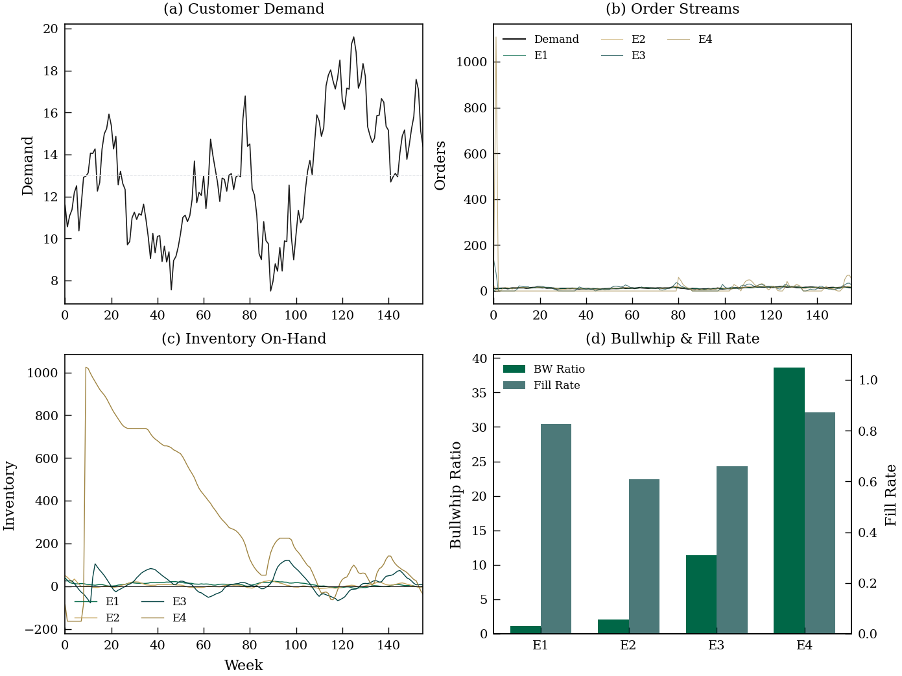

# DeepBullwhip

[![CI][ci-badge]][ci-url] [![codecov][cov-badge]][cov-url] [![V&V][vnv-badge]][vnv-url]
[![Docs][docs-badge]][docs-url] [![Python][py-badge]][repo-url] [![License][lic-badge]][lic-url] [![Version][ver-badge]][rel-url]

**Multi-tier supply chain bullwhip effect simulator with modular demand models, ordering policies, and cost functions.**

Maintained by the [AI Verification & Validation (AI V&V) Lab](https://ai-vnv.kfupm.io) at King Fahd University of Petroleum & Minerals (KFUPM).

<p align="center">
  
</p>

---

## Overview

DeepBullwhip provides a configurable simulation framework for studying the
[bullwhip effect](https://en.wikipedia.org/wiki/Bullwhip_effect) in serial
supply chains. It is designed for researchers and practitioners who need to:

- Simulate multi-echelon supply chains under different demand patterns
- Model arbitrary DAG supply chain topologies (serial, tree, convergent/divergent)
- Compare ordering policies (Order-Up-To, custom policies) and cost structures
- Quantify bullwhip amplification, fill rates, and total supply chain costs
- Optimize inventory levels and policy parameters using mathematical programming
- Generate publication-grade diagnostic visualizations (matplotlib + Graphviz)
- Run Monte Carlo experiments to study forecast-accuracy vs. robustness tradeoffs
- Integrate with the Python ecosystem: NetworkX, Graphviz, Pyomo

The package is extracted from a computational study on the accuracy–robustness
tradeoff in ML-driven semiconductor supply chains (see `simulation.ipynb`).

## Features

| Component | Description |
|-----------|-------------|
| **Demand generators** | Pluggable via `DemandGenerator` ABC. Built-in: AR(1) semiconductor, Beer Game step, ARMA(p,q), Replay from data |
| **Ordering policies** | Pluggable via `OrderingPolicy` ABC. Built-in: OUT, Proportional OUT, Smoothing OUT, Constant Order |
| **Cost functions** | Pluggable via `CostFunction` ABC. Built-in: Newsvendor (h+b), Perishable (h+b+obsolescence) |
| **Forecasters** | Pluggable via `Forecaster` ABC. Built-in: Naive, Moving Average, Exponential Smoothing, DeepAR (GluonTS) |
| **Benchmarking** | `BenchmarkRunner` for standardized policy/forecaster comparison with LaTeX/CSV export |
| **Datasets** | Built-in datasets: Beer Game, WSTS semiconductor, synthetic AR(1)/ARMA, M5 Walmart |
| **Registry** | Decorator-based `@register` system for easy extensibility and model discovery |
| **Supply chain** | `SerialSupplyChain` supporting arbitrary K-echelon serial topologies via `EchelonConfig` |
| **Network topologies** | `SupplyChainGraph` + `NetworkSupplyChain` for arbitrary DAG supply chains (trees, convergent/divergent) |
| **NetworkX integration** | Bidirectional graph conversion, critical path analysis, centrality, topological ordering |
| **Graphviz visualization** | Publication-quality SVG/PDF network rendering with metrics overlay |
| **Pyomo optimization** | Inventory optimization, policy parameter tuning, network design (MIP) |
| **Diagnostics** | 10 publication-grade plot functions + network diagram + geographic map visualization |
| **Metrics** | BWR, NSAmp, Fill Rate, Total Cost, Chen lower bound (standalone module + backward-compat diagnostics) |
| **Vectorized engine** | `VectorizedSupplyChain` — matrix-based `(N, K, T)` simulation for Monte Carlo batching. **~100x speedup** over serial for N=1000 paths |

## Installation

```bash
# Install from PyPI
pip install deepbullwhip

# With all optional dependencies
pip install deepbullwhip[all]
```

For development:

```bash
git clone https://github.com/ai-vnv/deepbullwhip.git
cd deepbullwhip
pip install -e ".[dev]"
```

### Dependencies

- **Core:** numpy, scipy, pandas, matplotlib
- **Dev:** pytest, pytest-cov
- **Optional (Network):** networkx (`pip install deepbullwhip[network]`)
- **Optional (Viz):** graphviz (`pip install deepbullwhip[viz]`)
- **Optional (Optimize):** pyomo (`pip install deepbullwhip[optimize]`)
- **Optional (ML):** scikit-learn, torch, gluonts (`pip install deepbullwhip[ml]`)
- **Optional (Benchmark):** kaggle, tabulate
- **All optional:** `pip install deepbullwhip[all]`

> **Apple Silicon (MPS) note:** GluonTS/PyTorch Lightning may fail on M1/M2/M3 Macs
> when the MPS backend is auto-selected. Set `PYTORCH_ENABLE_MPS_FALLBACK=1` before
> running DeepAR training or benchmarks:
> ```bash
> export PYTORCH_ENABLE_MPS_FALLBACK=1
> python benchmarks/run_leaderboard.py
> ```
> The CAIE experiment scripts set this automatically.

## Quick Start

```python
import numpy as np
from deepbullwhip import (
    SemiconductorDemandGenerator,
    SerialSupplyChain,
)

# 1. Generate demand (156 weeks, with shock at week 104)
gen = SemiconductorDemandGenerator()
demand = gen.generate(T=156, seed=42)

# 2. Simulate the default 4-echelon semiconductor supply chain
chain = SerialSupplyChain()
forecasts_mean = np.full_like(demand, demand.mean())
forecasts_std = np.full_like(demand, demand.std())
result = chain.simulate(demand, forecasts_mean, forecasts_std)

# 3. Inspect results
for k, er in enumerate(result.echelon_results):
    print(f"E{k+1}: {er.name:12s}  BW={er.bullwhip_ratio:.2f}  "
          f"FR={er.fill_rate:.0%}  Cost={er.total_cost:,.0f}")
```

## Benchmarking (v0.2.0)

Compare ordering policies and forecasting methods in a single call:

```python
from deepbullwhip.benchmark import BenchmarkRunner

runner = BenchmarkRunner(
    chain_config="semiconductor_4tier",  # or "beer_game", "consumer_2tier"
    demand="semiconductor_ar1",          # or "beer_game", "arma"
    T=156, N=100, seed=42,
)

# Compare policies
results = runner.run(
    policies=[
        "order_up_to",
        ("proportional_out", {"alpha": 0.3}),
        ("constant_order", {"order_quantity": 11.6}),
    ],
    forecasters=["naive", ("moving_average", {"window": 10})],
    metrics=["BWR", "FILL_RATE", "TC"],
)

# View results
print(results.pivot_table(index=["policy","echelon"], columns="metric", values="value"))

# Export
runner.export_csv(results, "benchmark_results.csv")
runner.export_latex(results, "benchmark_table.tex", caption="Policy Comparison")
```

### Adding Custom Models

Extend the framework with the 3-step pattern:

```python
from deepbullwhip.policy.base import OrderingPolicy
from deepbullwhip.registry import register

@register("policy", "my_policy")
class MyPolicy(OrderingPolicy):
    def __init__(self, lead_time: int, service_level: float = 0.95):
        self.lead_time = lead_time
    def compute_order(self, inventory_position, forecast_mean, forecast_std):
        return max(0.0, forecast_mean * 1.5 - inventory_position)

# Now use it in benchmarks:
results = runner.run(policies=["order_up_to", "my_policy"])
```

See [Notebook 03: Custom Policies](notebooks/03_custom_policies.ipynb) for a full walkthrough.

### Real-World Dataset Benchmarks

Run benchmarks on well-known demand datasets out of the box:

```python
from deepbullwhip.datasets.loader import load_dataset
from deepbullwhip.demand.replay import ReplayDemandGenerator

# Load M5 Walmart, Australian PBS, WSTS, or Beer Game
demand = load_dataset("m5", store="CA_1", dept="FOODS_1", freq="weekly")

runner = BenchmarkRunner(
    chain_config="consumer_2tier",
    demand=ReplayDemandGenerator(data=demand),
    T=200, N=10, seed=42,
)
results = runner.run(policies=["order_up_to", ("proportional_out", {"alpha": 0.3})])
```

| Dataset | Source | Frequency | Periods |
|---------|--------|-----------|---------|
| M5 Walmart | Kaggle M5 Competition | Weekly | 277 |
| Australian PBS | tidyverts/tsibbledata | Monthly | 197 |
| WSTS Semiconductor | Bundled sample | Monthly | 60 |
| Beer Game | Built-in | Weekly | 52 |

Download scripts for each dataset are in `data/raw/*/download.sh`.
See [`notebooks/08_benchmark_real_datasets.ipynb`](notebooks/08_benchmark_real_datasets.ipynb) for a cross-dataset comparison.

## Network Topologies (v0.3.0)

Model arbitrary DAG supply chains beyond serial chains:

```python
from deepbullwhip import SupplyChainGraph, EdgeConfig, NetworkSupplyChain, EchelonConfig
import numpy as np

# Define a distribution tree: Factory -> Warehouse -> {Retail_A, Retail_B}
graph = SupplyChainGraph(
    nodes={
        "Factory": EchelonConfig("Factory", lead_time=4, holding_cost=0.10, backorder_cost=0.40),
        "Warehouse": EchelonConfig("Warehouse", lead_time=2, holding_cost=0.15, backorder_cost=0.50),
        "Retail_A": EchelonConfig("Retail_A", lead_time=1, holding_cost=0.20, backorder_cost=0.60),
        "Retail_B": EchelonConfig("Retail_B", lead_time=1, holding_cost=0.20, backorder_cost=0.60),
    },
    edges={
        ("Factory", "Warehouse"): EdgeConfig(lead_time=3),
        ("Warehouse", "Retail_A"): EdgeConfig(lead_time=1),
        ("Warehouse", "Retail_B"): EdgeConfig(lead_time=1),
    },
)

# Simulate
chain = NetworkSupplyChain(graph)
T = 52
result = chain.simulate(
    demand={"Retail_A": np.full(T, 5.0), "Retail_B": np.full(T, 3.0)},
    forecasts_mean={"Retail_A": np.full(T, 5.0), "Retail_B": np.full(T, 3.0)},
    forecasts_std={"Retail_A": np.full(T, 1.0), "Retail_B": np.full(T, 1.0)},
)

for name, er in result.node_results.items():
    print(f"{name:12s}  BW={er.bullwhip_ratio:.2f}  FR={er.fill_rate:.0%}")
```

### NetworkX Integration

```python
from deepbullwhip import to_networkx, from_networkx
from deepbullwhip.network import find_critical_path, echelon_centrality

# Convert to NetworkX for graph analysis
G = to_networkx(graph)
print("Critical path:", find_critical_path(G))
print("Centrality:", echelon_centrality(G))

# Build from NetworkX
import networkx as nx
G = nx.DiGraph()
G.add_node("Supplier", lead_time=4, holding_cost=0.1, backorder_cost=0.4)
G.add_node("Store", lead_time=1, holding_cost=0.2, backorder_cost=0.6)
G.add_edge("Supplier", "Store", lead_time=2)
chain = NetworkSupplyChain.from_networkx(G)
```

### Graphviz Visualization

```python
from deepbullwhip import render_network, save_figure

# Render network diagram (with optional simulation overlay)
source = render_network(graph, sim_result=result, engine="dot", title="Distribution Tree")
save_figure(source, "network.pdf")
```

### Pyomo Optimization

```python
from deepbullwhip.optimize import tune_service_levels, tune_smoothing_factors

# Find optimal service levels via simulation-optimization
scenarios = np.random.default_rng(42).normal(10, 2, (50, 52))
scenarios = np.maximum(scenarios, 0)

result = tune_service_levels(graph, scenarios, objective="total_cost")
print("Optimal service levels:", result.parameters)
print("Expected cost:", result.objective_value)

# Find optimal smoothing factors
result = tune_smoothing_factors(graph, scenarios)
print("Optimal alpha_s:", result.parameters)
```

## Standardized Schema + Multi-Backend Rendering (v0.3.0)

Define supply chains in a standard JSON format and render identically across matplotlib, Graphviz, and TikZ:

### JSON Schema

```json
{
  "version": "1.0",
  "metadata": {"name": "Consumer 2-Tier", "tags": ["serial", "2-echelon"]},
  "nodes": [
    {"id": "Manufacturer", "config": {"lead_time": 4, "holding_cost": 0.10, "backorder_cost": 0.40},
     "layout": {"tier": 0, "role": "manufacturer"}},
    {"id": "Retailer", "config": {"lead_time": 1, "holding_cost": 0.20, "backorder_cost": 0.80},
     "layout": {"tier": 1, "role": "retailer"}}
  ],
  "edges": [{"source": "Manufacturer", "target": "Retailer", "config": {"lead_time": 3}}]
}
```

### Multi-Backend Rendering

```python
from deepbullwhip import render_graph, from_serial, to_json, save_json, load_json
from deepbullwhip.chain.config import beer_game_config

graph = from_serial(beer_game_config())

# Save to standard JSON
save_json(graph, "beer_game.json", metadata={"name": "Beer Game"})

# Render with matplotlib (default) — 4 built-in themes
fig = render_graph(graph, theme="kfupm")            # KFUPM green/gold (default)
fig = render_graph(graph, theme="ieee")              # IEEE grayscale, 3.5" width
fig = render_graph(graph, theme="presentation")      # Large fonts for slides
fig = render_graph(graph, theme="minimal")           # Clean black & white

# Render as TikZ for LaTeX papers
tex = render_graph(graph, backend="tikz", theme="ieee", title="Beer Game")
with open("beer_game.tex", "w") as f:
    f.write(tex)

# Render with Graphviz (requires pip install deepbullwhip[viz])
source = render_graph(graph, backend="graphviz", engine="dot")

# One-liner: load JSON and render
fig = render_from_json("beer_game.json", theme="kfupm")
```

### Supply Chain Examples (Different Tier Counts)

**2-Tier (Manufacturer → Retailer):**
```python
from deepbullwhip.chain.config import consumer_2tier_config
fig = render_graph(from_serial(consumer_2tier_config()), theme="minimal")
```

**4-Tier Beer Game (Factory → Distributor → Wholesaler → Retailer):**
```python
from deepbullwhip.chain.config import beer_game_config
fig = render_graph(from_serial(beer_game_config()), theme="kfupm", title="MIT Beer Game")
```

**Distribution Tree (Factory → Warehouse → {Store A, Store B}):**
```python
from deepbullwhip import SupplyChainGraph, EdgeConfig, EchelonConfig, render_graph

tree = SupplyChainGraph(
    nodes={
        "Factory": EchelonConfig("Factory", 4, 0.10, 0.40),
        "Warehouse": EchelonConfig("Warehouse", 2, 0.15, 0.50),
        "Store_A": EchelonConfig("Store_A", 1, 0.20, 0.60),
        "Store_B": EchelonConfig("Store_B", 1, 0.20, 0.60),
    },
    edges={
        ("Factory", "Warehouse"): EdgeConfig(lead_time=3),
        ("Warehouse", "Store_A"): EdgeConfig(lead_time=1),
        ("Warehouse", "Store_B"): EdgeConfig(lead_time=1),
    },
)
fig = render_graph(tree, theme="presentation", title="Distribution Network")
tex = render_graph(tree, backend="tikz", theme="ieee")  # For LaTeX papers
```

## Benchmark Leaderboard

See the [Benchmark Leaderboard](https://ai-vnv.github.io/deepbullwhip/LEADERBOARD/) on the docs site
([source](docs/LEADERBOARD.md)) for the latest benchmark results across all
registered forecasters, policies, and demand generators.

Run it yourself:

```bash
python benchmarks/run_leaderboard.py
```

## Contributing a New Component

deepbullwhip uses a registry architecture — adding a new forecaster, policy,
or demand generator requires no changes to existing code.

### Adding a Forecaster

**1. Implement the Forecaster ABC**

Create a file `deepbullwhip/forecast/my_forecaster.py`:

```python
import numpy as np
from deepbullwhip.forecast.base import Forecaster
from deepbullwhip.registry import register

@register("forecaster", "my_forecaster")
class MyForecaster(Forecaster):
    """One-line description."""

    def __init__(self, my_param: float = 1.0):
        self.my_param = my_param

    def forecast(
        self, demand_history: np.ndarray, steps_ahead: int = 1
    ) -> tuple[float, float]:
        # Your logic here — must return (mean, std)
        mean = float(np.mean(demand_history[-10:]))
        std = float(np.std(demand_history[-10:]))
        return mean, std
```

Key points:
- Must inherit from `Forecaster`
- Must use `@register("forecaster", "name")` decorator
- Must implement `forecast(demand_history, steps_ahead) -> (mean, std)`
- Optionally override `generate_forecasts(demand)` for batch efficiency
- If it has heavy dependencies (torch, gluonts, etc.), guard imports inside methods

**2. Register in `__init__.py`**

Add to `deepbullwhip/forecast/__init__.py`:

```python
# For lightweight dependencies:
from deepbullwhip.forecast.my_forecaster import MyForecaster

# For heavy/optional dependencies:
try:
    from deepbullwhip.forecast.my_forecaster import MyForecaster
except ImportError:
    pass  # requires optional dependency X
```

**3. Test locally**

```python
from deepbullwhip.benchmark import BenchmarkRunner

runner = BenchmarkRunner("semiconductor_4tier", "semiconductor_ar1", T=156, N=200, seed=42)
results = runner.run(
    policies=["order_up_to"],
    forecasters=["naive", "my_forecaster"],
    metrics=["BWR", "CUM_BWR", "FILL_RATE", "TC"],
)
print(results.pivot_table(
    index=["forecaster", "echelon"],
    columns="metric", values="value",
).to_string(float_format="%.1f"))
```

**4. Run the official benchmark**

```bash
python benchmarks/run_leaderboard.py
```

Include the output in your PR description.

### Adding a Policy

Same pattern — implement `OrderingPolicy` ABC:

```python
from deepbullwhip.policy.base import OrderingPolicy
from deepbullwhip.registry import register

@register("policy", "my_policy")
class MyPolicy(OrderingPolicy):
    def compute_order(self, inventory_position, forecast_mean, forecast_std) -> float:
        ...
```

### Adding a Demand Generator

Same pattern — implement `DemandGenerator` ABC:

```python
import numpy as np
from deepbullwhip.demand.base import DemandGenerator
from deepbullwhip.registry import register

@register("demand", "my_demand")
class MyDemandGenerator(DemandGenerator):
    def generate(self, T: int, seed: int | None = None) -> np.ndarray:
        ...
```

### PR Checklist

- [ ] Component file in the appropriate module (`forecast/`, `policy/`, `demand/`)
- [ ] `@register()` decorator with unique name
- [ ] Updated module `__init__.py`
- [ ] Unit test in `tests/`
- [ ] Benchmark output from `python benchmarks/run_leaderboard.py` pasted in PR description
- [ ] Optional dependencies added to `pyproject.toml` extras (if any)
- [ ] If your component requires heavy/optional dependencies (torch, gluonts, etc.),
  guard tests with `pytest.mark.skipif` so they skip gracefully when deps are missing

## Default Supply Chain Configuration

| Echelon | Role | Lead Time | h (holding) | b (backorder) |
|---------|------|-----------|-------------|---------------|
| E1 | Distributor / OEM | 2 weeks | 0.15 | 0.60 |
| E2 | Assembly & Test (OSAT) | 4 weeks | 0.12 | 0.50 |
| E3 | Foundry / Fab | 12 weeks | 0.08 | 0.40 |
| E4 | Wafer / Material Supplier | 8 weeks | 0.05 | 0.30 |

## Vectorized Monte Carlo Simulation

For large-scale experiments, use the matrix-based engine that processes
N demand paths simultaneously via NumPy broadcasting:

```python
from deepbullwhip import SemiconductorDemandGenerator, VectorizedSupplyChain

gen = SemiconductorDemandGenerator()
demand = gen.generate_batch(T=156, n_paths=1000, seed=42)  # (1000, 156)

vchain = VectorizedSupplyChain()
fm = np.full_like(demand, demand.mean())
fs = np.full_like(demand, demand.std())
result = vchain.simulate(demand, fm, fs)

# Average metrics across all 1000 paths
print(result.mean_metrics())

# Extract a single path as standard SimulationResult
sr = result.to_simulation_result(path_index=0)
```

**Benchmark (N=1000, T=156, K=4):**

| Engine | Time | Speedup |
|--------|------|---------|
| Serial (`SerialSupplyChain`) | 3.9s | 1x |
| Vectorized (`VectorizedSupplyChain`) | 0.04s | **~100x** |

The vectorized engine uses:
- Pre-allocated `(N, K, T)` order/inventory/cost matrices
- Circular buffer pipeline with O(1) indexing (vs O(L) list.pop)
- Fully vectorized OUT policy and newsvendor cost across N paths and K echelons per time step
- Batch demand generation via `generate_batch()` with `(N, T)` noise matrix

## Customization

### Custom echelon configuration

```python
from deepbullwhip import EchelonConfig, SerialSupplyChain

configs = [
    EchelonConfig("Retailer", lead_time=1, holding_cost=0.20, backorder_cost=0.80),
    EchelonConfig("Manufacturer", lead_time=6, holding_cost=0.10, backorder_cost=0.40),
]
chain = SerialSupplyChain.from_config(configs)
```

### Custom ordering policy

```python
from deepbullwhip.policy.base import OrderingPolicy

class MyPolicy(OrderingPolicy):
    def compute_order(self, inventory_position, forecast_mean, forecast_std):
        # Your logic here
        return max(0.0, forecast_mean - inventory_position)
```

### Custom cost function

```python
from deepbullwhip.cost.base import CostFunction

class MyCost(CostFunction):
    def compute(self, inventory):
        # Your logic here
        return abs(inventory) * 0.1
```

## Visualization

### Diagnostic plots

All plot functions return `matplotlib.figure.Figure` objects and support
`width="single"` (3.5") or `width="double"` (7.0") for journal formatting.
Colors use the KFUPM AI V&V Lab palette.

```python
from deepbullwhip.diagnostics.plots import (
    plot_demand_trajectory,
    plot_order_quantities,
    plot_inventory_levels,
    plot_inventory_position,
    plot_order_streams,
    plot_cost_timeseries,
    plot_cost_decomposition,
    plot_bullwhip_amplification,
    plot_summary_dashboard,
    plot_echelon_detail,
)

fig = plot_summary_dashboard(demand, result)
fig.savefig("dashboard.pdf", dpi=300)
```

### Network and geographic visualization

```python
from deepbullwhip.diagnostics.network import (
    kfupm_petrochemical_network,
    plot_network_diagram,
    plot_supply_chain_map,
)

network = kfupm_petrochemical_network()
fig = plot_network_diagram(network, sim_result=result)
fig = plot_supply_chain_map(network, sim_result=result)
```

### Batch figure generation

```bash
python scripts/visualize.py --save --outdir figures --dpi 600
```

## Project Structure

```
deepbullwhip/
├── __init__.py                 # Public API re-exports
├── _types.py                   # TimeSeries, EchelonResult, SimulationResult
├── registry.py                 # Decorator-based @register system
├── sensitivity.py              # Forecast sensitivity (lambda_f)
├── demand/
│   ├── base.py                 # DemandGenerator ABC
│   ├── semiconductor.py        # AR(1) + seasonal + shock
│   ├── beer_game.py            # Classic Beer Game step demand
│   ├── arma.py                 # General ARMA(p,q) process
│   └── replay.py              # Replay from historical data
├── policy/
│   ├── base.py                 # OrderingPolicy ABC
│   ├── order_up_to.py          # Order-Up-To (OUT) policy
│   ├── proportional_out.py     # Proportional OUT (POUT)
│   ├── constant_order.py       # Constant order (BWR=0)
│   └── smoothing_out.py        # Smoothing OUT
├── cost/
│   ├── base.py                 # CostFunction ABC
│   ├── newsvendor.py           # Newsvendor h/b cost
│   └── perishable.py           # Perishable (h+b+obsolescence)
├── forecast/
│   ├── base.py                 # Forecaster ABC
│   ├── naive.py                # Naive (sample mean/std)
│   ├── moving_average.py       # Rolling window MA
│   ├── exponential_smoothing.py # Single exponential smoothing
│   └── deepar.py               # DeepAR neural forecaster (GluonTS)
├── metrics/
│   ├── bullwhip.py             # BWR, CumulativeBWR
│   ├── inventory.py            # NSAmp, FillRate
│   ├── cost.py                 # TotalCost
│   └── bounds.py               # ChenLowerBound
├── benchmark/
│   ├── runner.py               # BenchmarkRunner
│   ├── configs.py              # Predefined chain configs
│   └── report.py               # LaTeX, Markdown, CSV export
├── datasets/
│   ├── beer_game.py            # Beer Game step demand
│   ├── synthetic.py            # AR(1), ARMA generators
│   ├── m5.py                   # M5 Walmart data loader
│   └── wsts.py                 # WSTS semiconductor data
├── chain/
│   ├── config.py               # EchelonConfig + defaults
│   ├── echelon.py              # SupplyChainEchelon
│   ├── serial.py               # SerialSupplyChain
│   ├── vectorized.py           # VectorizedSupplyChain (N,K,T) matrix engine
│   ├── graph.py                # SupplyChainGraph, EdgeConfig (v0.3.0)
│   └── network_sim.py          # NetworkSupplyChain (v0.3.0)
├── network/                    # NetworkX integration (v0.3.0)
│   ├── convert.py              # to_networkx, from_networkx
│   └── analysis.py             # critical path, centrality, etc.
├── optimize/                   # Pyomo optimization (v0.3.0)
│   ├── inventory.py            # Multi-echelon inventory optimization
│   ├── policy_tuning.py        # Service level / smoothing tuning
│   └── network_design.py       # Facility location MIP (experimental)
└── diagnostics/
    ├── metrics.py              # Bullwhip ratio, fill rate, etc.
    ├── plots.py                # 10 publication-grade plot functions
    ├── network.py              # Network diagram + geographic map
    └── graphviz_viz.py         # Graphviz rendering (v0.3.0)

├── schema/                     # JSON schema (v0.3.0)
│   ├── definition.py           # NodeLayoutHint, LayoutDefaults, NetworkMetadata
│   └── io.py                   # to_json, from_json, save/load
├── render/                     # Multi-backend renderer (v0.3.0)
│   ├── theme.py                # 4 built-in themes + registry
│   ├── layout.py               # Auto-layout from topology
│   ├── _matplotlib.py          # Matplotlib backend
│   ├── _graphviz.py            # Graphviz backend
│   ├── _tikz.py                # TikZ/LaTeX backend
│   └── api.py                  # Unified render_graph() entry point

benchmarks/
└── run_leaderboard.py              # Auto-generate docs/LEADERBOARD.md

scripts/
├── visualize.py                    # Batch diagnostic figure generation
├── generate_caie_figures.py        # CAIE 2026 paper figures (14 figures)
├── run_all_experiments.py           # CAIE 2026 paper numerical results
├── exp_chen_validation.py          # Chen et al. (2000) BWR formula validation
├── exp_corollary1.py               # Cumulative BWR concentration theorem
├── exp_cost_policy.py              # Cost asymmetry x policy interaction
└── exp_pareto.py                   # POUT alpha Pareto frontier

tests/                          # 385 unit tests, 98%+ coverage
notebooks/                      # All notebooks run on Google Colab
├── 01_supply_chain_cost.ipynb      # Costs, inventory, service level tradeoffs
├── 02_bullwhip_effect.ipynb        # Bullwhip amplification & Monte Carlo
├── 03_custom_policies.ipynb        # Custom policies, smoothing, @register
├── 04_network_viz_tutorial.ipynb   # DAG topologies, JSON schema, themes, NetworkX
├── 05_pyomo_optimization.ipynb     # Policy tuning, inventory opt, network design
├── 06_benchmark_policies.ipynb      # Systematic policy comparison
├── 07_benchmark_forecasters.ipynb   # Forecaster comparison
└── 08_benchmark_real_datasets.ipynb # M5, WSTS, Beer Game benchmarks
```

## Testing

```bash
# Run all tests
python -m pytest tests/ -v

# With coverage
python -m pytest tests/ --cov=deepbullwhip --cov-report=term-missing
```

Current: **385 tests** across all modules, **98%+ coverage**.

## Tutorials

All notebooks include Google Colab setup cells and run standalone.

| Notebook | Topic |
|----------|-------|
| [01 Supply Chain Cost](notebooks/01_supply_chain_cost.ipynb) | Newsvendor costs, holding vs backorder, service level tradeoffs |
| [02 Bullwhip Effect](notebooks/02_bullwhip_effect.ipynb) | Bullwhip amplification, Monte Carlo validation, Chen lower bound |
| [03 Custom Policies](notebooks/03_custom_policies.ipynb) | Implementing & registering custom ordering policies |
| [04 Network & Viz](notebooks/04_network_viz_tutorial.ipynb) | DAG topologies, JSON schema, NetworkX integration, multi-backend rendering |
| [05 Pyomo Optimization](notebooks/05_pyomo_optimization.ipynb) | Service level tuning, inventory optimization, network design |

## Citation

If you use DeepBullwhip in your research, please cite:

```bibtex
@software{deepbullwhip,
  title  = {DeepBullwhip: Multi-Tier Supply Chain Bullwhip Effect Simulator},
  author = {Arief, Mansur M.},
  url    = {https://github.com/ai-vnv/deepbullwhip},
  year   = {2025}
}
```

## Documentation

Full API documentation is available at [ai-vnv.github.io/deepbullwhip](https://ai-vnv.github.io/deepbullwhip).

## License

MIT License. See [LICENSE](LICENSE) for details.

Developed and maintained by the [AI V&V Lab](https://ai-vnv.kfupm.io) at KFUPM.

<!-- badges -->
[ci-badge]:   https://github.com/ai-vnv/deepbullwhip/actions/workflows/ci.yml/badge.svg
[ci-url]:     https://github.com/ai-vnv/deepbullwhip/actions/workflows/ci.yml
[cov-badge]:  https://codecov.io/gh/ai-vnv/deepbullwhip/graph/badge.svg
[cov-url]:    https://codecov.io/gh/ai-vnv/deepbullwhip
[vnv-badge]:  https://img.shields.io/endpoint?url=https://ai-vnv.github.io/deepbullwhip/vnv-badge.json
[vnv-url]:    https://github.com/ai-vnv/deepbullwhip/blob/main/vnvspec.yaml
[docs-badge]: https://img.shields.io/badge/docs-ai--vnv.github.io%2Fdeepbullwhip-006747
[docs-url]:   https://ai-vnv.github.io/deepbullwhip
[py-badge]:   https://img.shields.io/badge/python-3.10%20%7C%203.11%20%7C%203.12%20%7C%203.13-blue
[repo-url]:   https://github.com/ai-vnv/deepbullwhip
[lic-badge]:  https://img.shields.io/badge/License-MIT-yellow.svg
[lic-url]:    https://opensource.org/licenses/MIT
[ver-badge]:  https://img.shields.io/badge/version-0.4.1-orange
[rel-url]:    https://github.com/ai-vnv/deepbullwhip/releases
